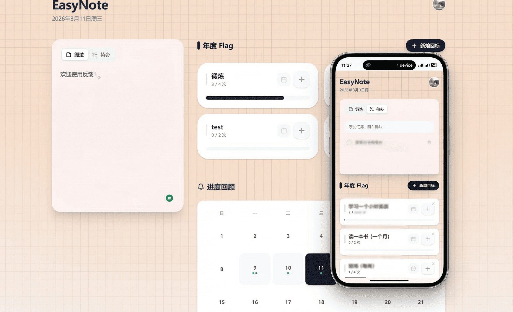

# EasyNote 📝

**EasyNote** 是一款极简主义风格的个人效率管理应用，结合了**年度目标（Flag）追踪**、**随手记/待办事项**以及**日历进度回顾**功能。支持 GitHub / Google 快捷登录与 Supabase 云端同步，在手机和电脑上随时查看同一份数据。

🌐 **官方网址（推荐）**：[https://www.easynote.date/](https://www.easynote.date/)
> V1.3 更新：已配置 Cloudflare 全球加速与自动路由，国内网络环境可直连访问。

<div align="center">
  
</div>

---

## 🌐 网络体验指南

EasyNote 已在 Cloudflare 节点部署，为全球（包括中国大陆）提供顺畅的网络访问体验。

### 访问状态
> **国内直连**：已启用自动域名解析与 Cloudflare CDN 优化，**无需挂载 VPN 代理即可稳定全功能访问**。

### 多边同步
> **无缝数据更新**：在常规网络环境下，保持设备联网即可实现所有终端（手机/电脑）上的高实时数据双向同步。在网络离线时也可通过本地缓存回退支持（Offline-First）。

### 部署方式
- **正式地址**：[https://www.easynote.date/](https://www.easynote.date/)
- **本地运行**：通过 `npm run dev` 在本地环境运行。

---

## ✨ 核心特性

- 🎯 **Flag 目标追踪系统**
  - **进度跟踪**：设定目标次数（如：每周跑步 3次），每次完成点击打卡，实时查看进度条。
  - **智能转化**：在"想法"模式下输入带数字的文本（如："本月完成阅读 5 本书"），可一键通过行级闪电图标⚡快捷创建新 Flag。
  - **拖拽排序**：原生支持 HTML5 拖放（Drag & Drop），轻松调整 Flag 优先级。
  - **周期轮回**：支持"每周轮回"和"每月轮回"模式，到期自动归零重新开始。
  - **交互反馈**：打卡按钮具备真实的"物理按压"缩放反馈；Flag 达到 100% 完成态时，背景平滑过渡至琥珀色（Amber），支持一键重置。

- 📅 **年度进度回顾（Monthly Block Calendar）**
  - **可视化日历**：按月切换显示的日历，自动高亮"今天"。
  - **状态映射**：有打卡记录的日期自动呈现对应 Flag 专属配色的指示点。
  - **完成日发光特效**：当某项 Flag 在一天内完成时，该日期格子会触发脉冲流光动画。

- 📝 **极简边栏：想法与待办**
  - **双模式自由切换**：在无拘无束的"想法"文本框与结构化的"待办任务"列表间无缝切换。
  - **悬浮操作**：待办事项支持悬浮删除交互（移动端始终可见）。

- 🔐 **GitHub / Google 快捷登录 + 云端无缝同步**
  - **一键认证**：内置 GitHub 与 Google OAuth 授权，抛开心智负担，彻底告别密码注册烦恼。
  - **跨设备同步**：手机和电脑登录同一个账号，数据实时双向同步，打卡不怕换设备。
  - **实时 Upsert**：每次操作（打卡、新增、编辑）都会实时写入 Supabase 云端数据库。
  - **离线可用**：断网时自动回退到 localStorage 本地缓存，联网后无缝恢复。

- 📱 **PWA 移动端适配**
  - **添加到主屏幕**：在手机浏览器中可以"添加到桌面"，像原生 APP 一样全屏运行。
  - **响应式布局**：界面针对手机和平板做了全面适配，侧边栏自动收为单栏。
  - **触摸优化**：按钮大小、间距、弹窗位置都针对手指操作做了调整。
  - **安全区域**：适配刘海屏、底部手势条等手机特殊区域。

## 🛠️ 技术栈

- **框架**: React 19 + TypeScript + Vite 7
- **样式**: Tailwind CSS v4（自定义动画 `glow-pulse`、`btn-press-active` 等在 `index.css` 声明）
- **图标**: Lucide React
- **认证**: Supabase Auth (GitHub / Google OAuth)
- **数据库**: Supabase PostgreSQL（flags 表 + memos 表，RLS 行级安全）
- **离线缓存**: localStorage 作为本地 fallback
- **PWA**: vite-plugin-pwa (支持静默更新与 Service Worker)

## 🚀 快速启动

1. 确保本地安装了 [Node.js](https://nodejs.org/)。
2. 克隆仓库：
   ```bash
   git clone https://github.com/Tyleraltight/EasyNote.git
   ```
3. 安装依赖：
   ```bash
   cd EasyNote
   npm install
   ```
4. 创建 `.env.local` 并填入你的 Supabase 凭据：
   ```env
   VITE_SUPABASE_URL=https://your-project.supabase.co
   VITE_SUPABASE_ANON_KEY=your-anon-key
   ```
5. 在 Supabase SQL Editor 中执行 `supabase-schema.sql` 建表。
6. 启动开发服务器：
   ```bash
   npm run dev
   ```
7. 打开浏览器访问 `http://localhost:5173`，使用 GitHub 或 Google 登录即可开始体验极简效率之旅。

## 💡 设计理念

- **KISS 原则**：极简且高度内聚的代码，不引入不必要的状态管理或沉重的第三方库。
- **云端优先，离线兜底**：数据默认存在云端实现跨设备同步，断网时 localStorage 无缝接管，用户完全无感知。
- **移动端不是附属品**：界面从一开始就考虑手机使用场景，不是桌面端的缩水版，而是同样好用的完整体验。

## 📄 License

This project is licensed under the [MIT License](./LICENSE).

---

<div align="center">
  <p>If this project helps you, please give it a ⭐. It means a lot to me!</p>
</div>
