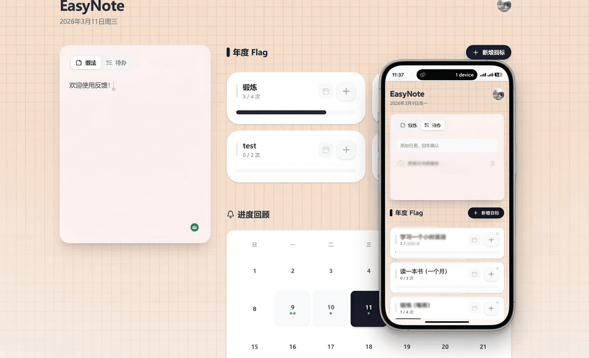

# EasyNote 📝

**EasyNote** is a minimalist personal productivity app combining **Annual Flag/Goal Tracking**, **Quick Notes & To-dos**, and **Monthly Check-in History**. Powered by GitHub & Google OAuth and Supabase cloud sync, seamlessly access your data across mobile and desktop devices.

🌐 **Live Demo**: [https://www.easynote.date/](https://www.easynote.date/)

<div align="center">
  
</div>

English | [简体中文](./README.md)

---

## ✨ Key Features

- 🎯 **Target Flag Tracking**
  - **Progress Tracking**: Set target counts (e.g. 3 workouts per week), click to check-in, and monitor real-time progress bars.
  - **Smart Conversion**: In "Notes" mode, typing lines with numbers (e.g. "Read 5 books this month") allows one-click conversion to a Flag via the ⚡ lightning button.
  - **Drag & Drop Reordering**: Native HTML5 Drag & Drop for reordering flag priorities.
  - **Reset Cycle**: Supports "Weekly Reset" and "Monthly Reset" modes.
  - **Tactile Feedback**: Press scaling animations on check-in buttons. Flags transition smoothly to an Amber theme upon 100% completion.
  - **🌐 Multilingual Support**: Instant toggle between English and Simplified Chinese, with automatic browser language detection.

- 📅 **Monthly Progress Review (Block Calendar)**
  - **Visual Calendar**: Monthly calendar view with automatic "Today" highlight.
  - **Color-Coded Status**: Activity dates display color indicators corresponding to flag themes.
  - **Glow Pulse Effect**: Dates with completed goals feature an animated glow pulse.

- 📝 **Minimalist Sidebar: Notes & To-dos**
  - **Dual Mode**: Seamlessly switch between freeform notes and structured to-do lists.
  - **Quick Management**: Hover action buttons for deleting/pinning tasks.

- 🔐 **GitHub & Google OAuth + Cloud Sync**
  - **One-Click Sign-In**: Authenticate securely via GitHub or Google OAuth.
  - **Cross-Device Sync**: Access your data everywhere with automatic Supabase PostgreSQL syncing.
  - **Offline Resilience**: Automatic fallback to `localStorage` when offline.

- 📱 **PWA & Mobile Ready**
  - **Add to Home Screen**: Install as a full-screen standalone app on iOS and Android.
  - **Responsive Layout**: Tailored for mobile screens, gesture bars, and notch safety zones.

## 🛠️ Tech Stack

- **Framework**: React 19 + TypeScript + Vite 7
- **Styling**: Tailwind CSS v4
- **i18n**: i18next + react-i18next + i18next-browser-languagedetector
- **Icons**: Lucide React
- **Auth & Database**: Supabase Auth & PostgreSQL
- **PWA**: vite-plugin-pwa (Service Worker + Web Manifest)

## 🚀 Quick Start

1. Ensure [Node.js](https://nodejs.org/) is installed.
2. Clone the repository:
   ```bash
   git clone https://github.com/Tyleraltight/EasyNote.git
   ```
3. Install dependencies:
   ```bash
   cd EasyNote
   npm install
   ```
4. Create `.env.local` with your Supabase credentials:
   ```env
   VITE_SUPABASE_URL=https://your-project.supabase.co
   VITE_SUPABASE_ANON_KEY=your-anon-key
   ```
5. Run `supabase-schema.sql` in Supabase SQL Editor.
6. Launch development server:
   ```bash
   npm run dev
   ```
7. Open `http://127.0.0.1:5173` in your browser.

## 📄 License

This project is licensed under the [MIT License](./LICENSE).

---

<div align="center">
  <p>If this project helps you, please give it a ⭐. It means a lot!</p>
</div>
